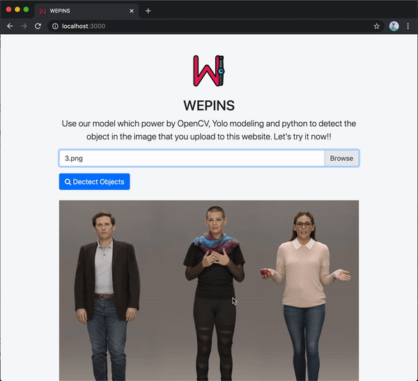

# WEPINS 

WEPINS is just the prototype of the Web-services for Python AI model in NodeJS. In this prototype, we use Yolo object detection to be the example of python processing. 



## Installation
I assume you have macOS Catalina 10.15.5 with [brew](https://brew.sh/) and [Python3.7.7](https://www.python.org/downloads/).

Install Node.
```sh
$ brew update
$ brew install node
```

Install Python library.
```sh
$ pip install numpy
$ pip install opencv-python
```
Clone the repository
```sh
$ git clone https://github.com/61130061/WEPINS.git
```
Then install the packages and run 'app.js'
```sh
$ npm install
$ node app.js
```

## Using the web app
coming...

## Tech
* [node.js](https://nodejs.org/) - evented I/O for the backend
* [python](https://www.python.org/downloads/) - AI processing
* [bootstrap](https://getbootstrap.com/) - Frontend UI

## Future
* Upload image to NodeJS server via frontend html website.
* Run python file via NodeJS server.
* Show the output of the python file on the website.

